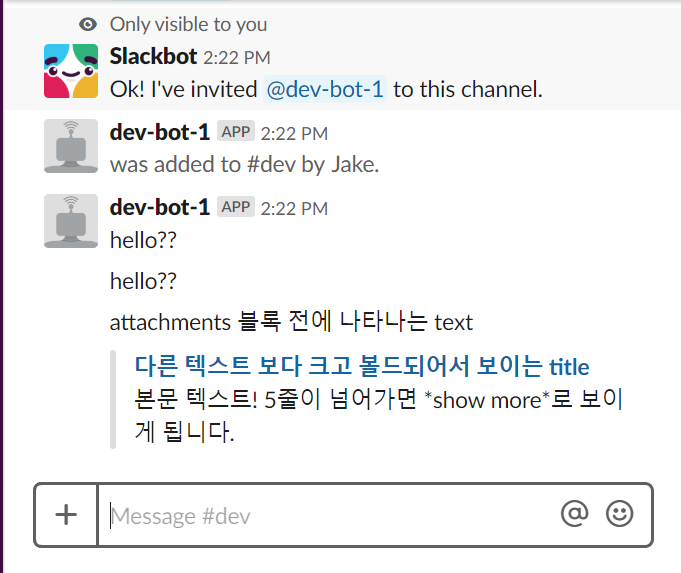

# Slacker 사용방법
- slack workspace 만드는 방법 생략
## bot 등록
    https://slack.com/apps/ 에서 bot 추가.
    추가하면 api 키를 준다.
## python slacker 사용 방법

```buildoutcfg
from slacker import Slacker

token = ''
slacker = Slacker(token)

slacker.chat.post_message('#dev', 'hello??', as_user=True)

```

```buildoutcfg
token = ''
slacker = Slacker(token)

attachments_dict = dict()
attachments_dict['pretext'] = "attachments 블록 전에 나타나는 text"
attachments_dict['title'] = "다른 텍스트 보다 크고 볼드되어서 보이는 title"
attachments_dict['title_link'] = "https://corikachu.github.io"
attachments_dict['fallback'] = "클라이언트에서 노티피케이션에 보이는 텍스트 입니다. attachment 블록에는 나타나지 않습니다"
attachments_dict['text'] = "본문 텍스트! 5줄이 넘어가면 *show more*로 보이게 됩니다."
attachments_dict['mrkdwn_in'] = ["text", "pretext"]  # 마크다운을 적용시킬 인자들을 선택합니다.
attachments = [attachments_dict]

slacker.chat.post_message(channel="#dev", text=None, attachments=attachments, as_user=True)
```


!참고 : [slack api docs](https://api.slack.com/methods)

## template 제작 하기. [git](https://github.com/passionsjin/slacker_toying.git)
    작성중
    
    
 
