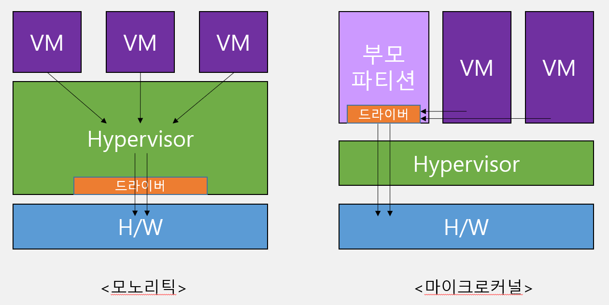
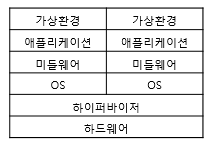
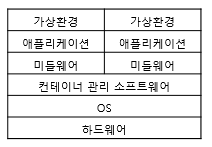

# Hypervisor - 1 ( 사내 강의 )

- Hardware의 가용성을 위해 software적으로 가상화를 구현

## intel-vt ( VT-D 란? )

- VT-D는 가상머신에서 장치에 직접 엑세스를 할 수 있게 해주는 기능.

## 가상화의 종류
### Host 가상화
    Host OS 바로 위에 Guest OS가 구동됨.
    OS 위에 얹혀 Guest OS의 커널 요청에 대한 오버헤드가 크다.


 

### hypervisor 가상화
    Host OS없이 하드웨어에 하이퍼바이저를 설치하여 사용.
    Xen, MS hyper-V, citrix, KVM 등등

- 효율적으로 리소스를 사용할 수 있지만,
- 자체적으로 관리 기능이 필요


- 전가상화 : 하이퍼바이저가 모든 명령을 중재함.
- 반가상화 : Hyper call 을 통해 하이퍼바이저에게 직접 요청함.

### 컨테이너 가상화
    호스트 OS위에 컨테이너 관리 소프트웨어를 설치하고,
    논리적으로 컨테이너를 나누어 사용한다.



## 가상화 동작
- CPU 처리방법
```buildoutcfg
CPU 개수는 실제 물리적인 CPU 점유율의 우선순위를 나타낸다.
Guest OS는 할당된 CPU 개수 이상으로 성능을 내지 못함.
그렇다면, 8core 가 필요한 app이 1core를 할당받아도 돌아는감. 느릴뿐,..
```
- Memory 처리방법
```buildoutcfg
페이징방식으로 동적할당.
그래도 부족하면 Hypervisor 영역을 할당받기도한다.
```
- Disk, Network
```buildoutcfg
Disk, Network는 Bus를 통해 원격지와 통신.
```
- NUMA
```buildoutcfg
Non-Uniform Memory Access는 통합된 Memory 영역인 Uniform Memory가 아닌 Local Memory를 접근하기 위한 방법
```
-vNUMA
```buildoutcfg
물리적인 CPU와 Memory의 양을 계산하여 논리적으로 CPU와 Memory의 관계를 설정하여 VM에 할당
최소한의 접근을 위하여 논리적으로 Node를 나누어 Memory 접근을 최적화
```

## Disk / snapshot
    고정, 동적, 차이점 보관법이있다.
### 참고
- [VTD-란 무엇인가](https://parkbrother.tistory.com/entry/VTD-%EB%9E%80-%EB%AC%B4%EC%97%87%EC%9D%B8%EA%B0%80)